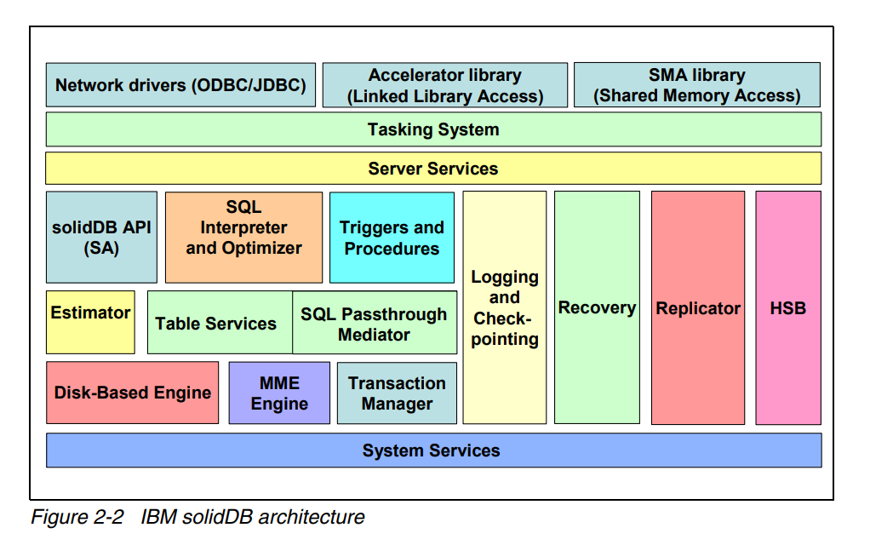
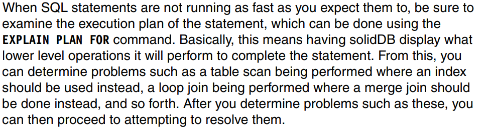
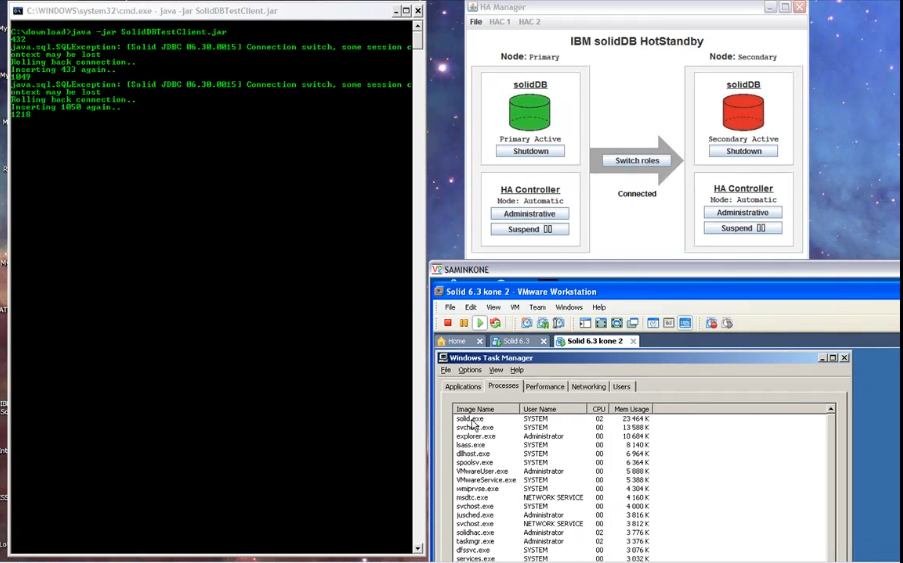

# SolidDB


## История развития

История развития SolidDB началась в 1992 году, когда шведская компания Solid Information Technology была основана Юргеном Густавссоном (Jürgen Gustavsson) и Уве Дольфсоном (Ulf Dollingsson). Они разработали СУБД SolidDB с уникальной архитектурой, которая полностью хранила данные в оперативной памяти для достижения высокой производительности. Это позволяло сократить задержку, обычно связанную с операциями чтения и записи на диске.

В 2008 году IBM приобрела Solid Information Technology, включив SolidDB в свою линейку продуктов. После этого SolidDB стала доступна как часть решений IBM, таких как IBM InfoSphere Data Replication и IBM System z.

## Инструменты для взаимодействия с SolidDB

Некоторые популярные SQL-клиенты, такие как MySQL Workbench, DBeaver, Navicat и SQL Server Management Studio. Они могут быть настроены для подключения к SolidDB и выполнения операций базы данных.

JDBC/ODBC драйверы: SolidDB предоставляет драйверы JDBC (Java Database Connectivity) и ODBC (Open Database Connectivity), которые позволяют вам использовать язык программирования Java или любой язык, поддерживающий ODBC, для взаимодействия с базой данных SolidDB.

API и библиотеки: SolidDB предлагает API и библиотеки разных языков программирования для интеграции.

## Какой database engine используется
SolidDB использует свой собственный database engine, который разработан компанией Solid Information Technology. Этот database engine специально оптимизирован для работы в оперативной памяти и обеспечивает высокую производительность и низкую задержку доступа к данным.

## Архитектура SolidDB


## Язык запросов
Язык запросов, используемый в SolidDB, полностью основан на стандарте SQL. Поэтому запросы стандартные.
```sql
SELECT * FROM employees WHERE department = 'IT';
INSERT INTO employees (name, age, department) VALUES ('John Smith', 30, 'Sales');

```

## Распределение файлов по разным носителям
SolidDB, как СУБД, разработана для работы с данными, хранящимися в оперативной памяти, поэтому SolidDB не предоставляет встроенных механизмов для распределения файлов базы данных по различным носителям.

## На каких языках написана СУБД
SolidDB реализована на C++.

## Какие типы индексов поддерживаются?
Стандартный набор.
SolidDB поддерживает следующие типы индексов:

- B-деревья
- Хеш-индексы
- Кластерные индексы 
- Уникальные индексы 
- Полнотекстовые индексы (для эффективного выполнения поиска по текстовым данным)

## Процесс выполнения запросов
Процесс выполнения запросов в SolidDB включает несколько основных шагов:

- Синтаксический анализ
- Оптимизация запроса
- Планирование выполнения 
- Выполнение запроса 
- Возврат результатов

## План выполнения запросов
Такое, действительно, есть. 
Планирование запросов в SolidDB включает сбор статистики о данных, генерацию кандидатов, оценку и выбор оптимального плана выполнения запроса. Цель - минимизировать время и ресурсы, необходимые для выполнения запроса. План выполнения выбирается на основе стоимости и состоит из операций чтения, записи, сортировки и объединения данных.

[Документация](https://www.redbooks.ibm.com/redbooks/pdfs/sg247887.pdf) стр. 107




## Транзакции
[Документация](https://www.redbooks.ibm.com/redbooks/pdfs/sg247887.pdf) стр. 27

IBM solidDB гарантирует надежную обработку транзакций за счет реализации
сервера базы данных, который удовлетворяет всем требованиям ACID 

## Методы восстановления
**Журналирование транзакций:** СУБД сохраняет журнал операций транзакций, включая изменения данных, примененные к базе данных. В случае сбоя или ошибки, эти журналы используются для восстановления базы данных до последнего согласованного состояния.

**Точки сохранения (Savepoints):** Это механизм, который позволяет сохранить текущее состояние транзакции. В случае сбоя или отката транзакции, СУБД может использовать точку сохранения для восстановления состояния транзакции до сохраненного момента.

**Копирование данных (Data Replication):** СУБД может поддерживать механизм репликации данных, который обеспечивает наличие нескольких копий данных на различных серверах или устройствах хранения. В случае сбоя одной копии, можно использовать другую копию для восстановления данных.

**Резервное копирование (Backup):** СУБД предоставляет возможность создания резервных копий базы данных для восстановления в случае полного сбоя или потери данных.

## Шардирование
SolidDB поддерживает горизонтальное шардирование. Можно релизовать следующими методами. 

**Диапазонное шардирование (Range-based Sharding):** При диапазонном шардировании данные разбиваются на шарды на основе диапазона значений ключа.

**List Sharding:** В этом методе данные разделены на шарды на основе определенных критериев, таких как категории, типы или другие атрибуты. Каждый шард содержит определенный список записей, соответствующих этим критериям.

**Хэширование (Hashing):** В этом методе каждая запись данных хешируется и назначается конкретному шарду на основе хеш-значения.

## Data mining, data warehousing и OLAP.
SolidDB, как оперативно-ориентированная СУБД, не предоставляет встроенных функций для data warehousing, data mining, OLAP в традиционном понимании. Однако можно интегрировать с дреугими инструментами. Преимущество здесь - полная поддержка SQL.

## Методы защиты

SolidDB поддерживает аутентификацию, авторизацию и шифрование данных для обеспечения безопасности. Он также предоставляет аудит, журналирование и механизмы транзакций для контроля и целостности данных. Ограничение доступа позволяет настраивать права доступа для пользователей и объектов базы данных.

## Какие сообщества поддерживают SolidDB
SolidDB был разработан и первоначально выпущен фирмой Solid Information Technology. В 2008 году компания была приобретена корпорацией IBM, и с тех пор SolidDB является продуктом IBM.

## Документация
https://www.redbooks.ibm.com/redbooks/pdfs/sg247887.pdf \
https://www.dbdb.io/db/soliddb

## Демобаза
Поскольку язык запросов SolidDB полностью основан на стандарте SQL, то для изучения подойдет любой SQL-тренажер.

## Демонстрация процесса работы на windows


## Как быть в курсе происходящего?
https://www.teamblue.unicomsi.com/news-and-events/news/ - следить за новостями


